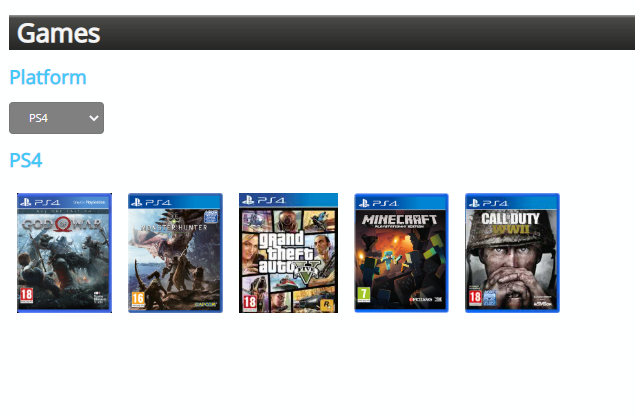
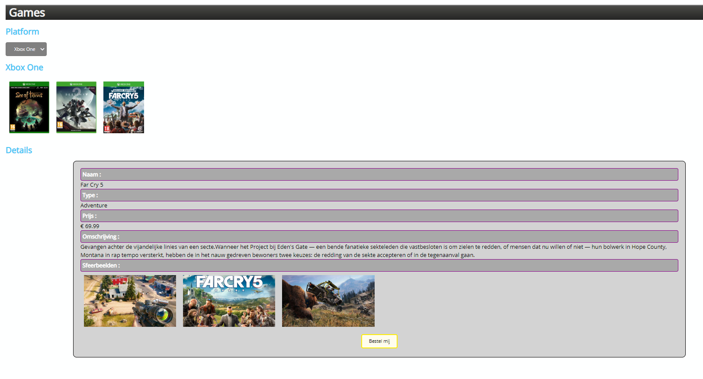
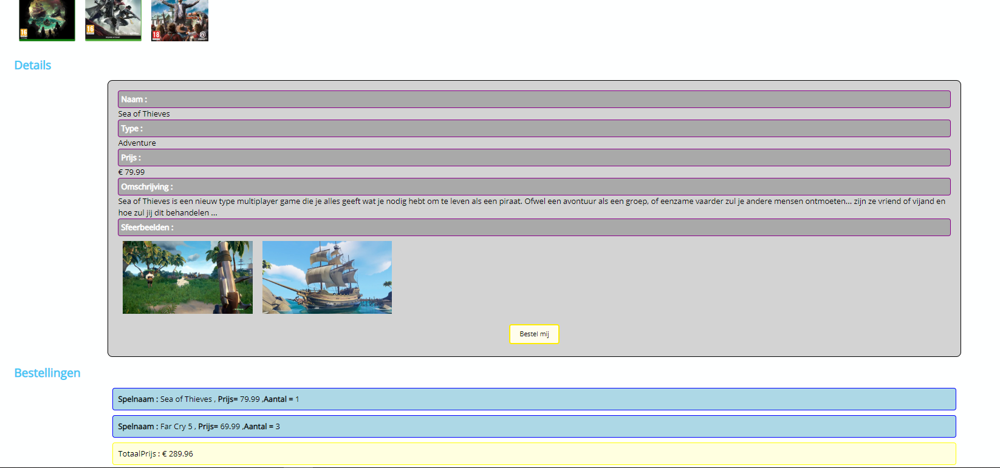

# Eindevaluatie Web Frontend Advanced
Dit examen maakt 100% uit van de evaluatie van de module Web Frontend Advanced.   
Lees aandachtig de opgave bij de start van het examen.

## Algemene richtlijnen
* Het examen is **open boek**, dit betekent dat je de volledige cursus kan gebruiken, alsook alle oefeningen die tijdens de lessenreeks werden gebruikt.
* Iedere vorm van samenwerking is **niet** toegelaten.
* Maak regelmatig (per functionaliteit) een Commit en een push naar je online Repo.
  * Voorzie minimaal 2 Commits/Pushes per uur.
  * Commit volgens de afspraken.
* Iedere **vaststelling van onregelmatigheid** wordt conform het OER gemeld aan de betrokken student en aan de voorzitter van de examencommissie.

## Opgave
* Vervolledig de meegeleverde webpagina aan de hand van de bijgeleverde .js/.json datafile, deze datafile mag niet worden aangepast.
* Bij het inladen van de pagina worden in de select de categoriën van spelen opgevuld. De gebruiker ziet een overzicht van de eerste categorië aan de hand van afbeeldingen.
* Bij het aanklikken van een spelafbeelding krijgt de gebruiker de details te zien van de keuze : 
  * Naam van het spel
  * Type spel
  * Prijs spel
  * Beschrijving spel
  * DetailsFoto of foto's spel

* Wanneer de gebruiker een spel aankoopt via de daartoe voorziene knop wordt deze aankoop onderaan de pagina weergegeven en wordt tevens **de totaalprijs** van de aankopen berekend tot 2 cijfers na de komma. Per product bestaat er slechts 1 aankooplijn.

* Voorzie zelf met behulp van een extra css-file een opmaak voor de uitwerking.

## Voorbeeld (GUI kan naar eigen smaak worden aangepast)
### StartSituatie

### ProductKeuze

### Bestellingen

